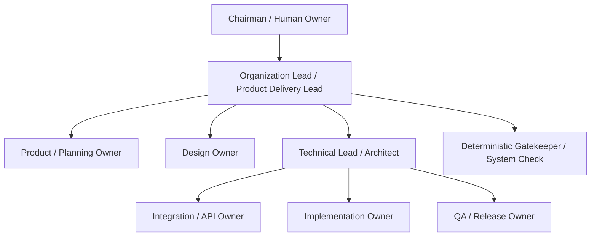

# ORGANIZATIONS.md - Organizations and Reporting

## English

### Purpose

Use this file to describe the organizations, roles, responsibilities, reporting lines, routing guidance, and escalation paths that agents should understand while working in this workspace.

This file is guidance only. It does not automatically enforce routing, approvals, delegation, access control, security policy, or workflow state. Humans or approved tools must still make explicit decisions.

Do not paste secrets, API keys, tokens, passwords, credentials, private keys, sensitive personal data, or exhaustive people records into this file. Summarize sensitive organization or people details instead of copying raw records.

Agents may help draft or update this file, but user-editable content remains the source of truth.

### Overspec Controls

This file should stay portable. It must not become a project-specific runbook.

Use these controls when editing:

- Keep organization and reporting guidance here.
- Keep concrete commands, validators, evidence paths, ticket workflows, code-review workflows, skill names, tool names, and repository paths in workspace-specific workflow or policy files.
- Do not duplicate full role contracts from specialist role documents.
- Do not treat the example chart as fixed company structure.
- Do not define a new approval schema here.
- Do not make deterministic gates look like human or LLM roles.
- If a detail only makes sense in one repository, move it out of this file and link to the approved workspace document instead.

### Organization Records

For each organization, record only the information needed to understand ownership and escalation.

```md
### <Organization Name>

- Mission:
- Owner:
- Members:
- Interfaces / dependencies:
- Parent organization:
- Child organizations:
- Decision surfaces owned:
- Escalation owner:
```

### Suggested Reporting Pattern

The following tree is an example reporting pattern, not a mandatory hierarchy.

```text
Chairman / Human Owner
  Organization Lead / Product Delivery Lead
    Product / Planning Owner
    Design Owner
    Technical Lead / Architect
      Integration / API Owner
      Implementation Owner
      QA / Release Owner
    Deterministic Gatekeeper / System Check
```

Interpretation:

- The tree shows coordination and escalation paths.
- It does not grant unrestricted decision authority.
- Specialist quality remains with the specialist owner.
- Human-gated decisions remain with the assigned human owner.
- Deterministic gates report check status only; they do not approve risk.

Optional Mermaid preview:



### Role Archetypes

Use role archetypes to clarify ownership. Replace names when a workspace uses different role names, but keep ownership boundaries explicit.

| Role archetype | Owns | Routes to | Escalates | Must not |
| --- | --- | --- | --- | --- |
| Chairman / Human Owner | Final human-owned business, risk, policy, or approval decisions | Organization Lead | Higher business or legal authority when needed | Receive secrets through this file; imply approval through silence unless approved policy says so |
| Organization Lead / Product Delivery Lead | Intake coordination, scope framing, readiness, owner assignment, non-goals, and escalation routing | Product, Design, Technical, Integration, Implementation, QA, Human Owner | Human Owner for gated decisions; specialist owner for domain decisions | Implement specialist work; approve specialist quality; bypass human gates |
| Product / Planning Owner | Clarification, bounded work definition, acceptance framing, planning completeness, and handoff readiness | Design, Technical Lead, Integration, Implementation, QA, Human Owner | Human Owner for gated decisions; Organization Lead for priority conflicts | Turn unclear requests into execution work; treat chat as final source of truth without an accepted record |
| Design Owner | UX quality, interaction, visual hierarchy, design options, and design handoff quality | Product/Planning, Technical Lead, Implementation, QA | Product/Planning for scope; Human Owner for gated decisions | Own product scope alone; ask a non-design owner to approve design quality |
| Technical Lead / Architect | Architecture, technical feasibility, dependency impact, integration risk, runtime boundaries, and releaseability | Product/Planning, Integration, Implementation, QA | Human Owner for risk acceptance; Product/Planning for scope change | Absorb implementation or integration ownership by default; accept failed-gate risk |
| Integration / API Owner | Contract shape, data boundaries, integration behavior, auth/session behavior, error mapping, compatibility, and rollback concerns | Technical Lead, Implementation, QA | Product/Planning for scope; Technical Lead for architecture; Human Owner for gated decisions | Invent product scope; duplicate contracts when a shared source exists |
| Implementation Owner | Approved implementation tasks, local implementation details, tests, and implementation evidence | QA, reviewer, Technical Lead, Integration, Product/Planning | Product/Planning for scope; Technical Lead or Integration for uncertainty | Expand scope; invent contracts; skip required evidence; self-approve gated readiness |
| QA / Release Owner | Evidence planning, test records, release-readiness summary, failure classification, and release-risk reporting | Implementation, Technical Lead, Product/Planning, Human Owner | Human Owner for production or risk acceptance | Fix implementation as default owner; approve production submit; treat untested surfaces as proven |
| Deterministic Gatekeeper / System Check | Defined pass/fail or status result from required evidence | Owning workflow or role | Owning workflow when a check fails | Perform LLM judgment; replace review; replace human approval; accept failed-gate risk |

### Reporting Lines

Use reporting lines to clarify communication, not to collapse ownership.

- Direct reporting line: who normally receives progress, blocker, and completion reports.
- Peer relationship: who must coordinate as an equal owner.
- Advisory relationship: who provides specialist input without taking ownership.
- Escalation owner: who can resolve or route a blocked decision.

Rules:

1. A lead can coordinate work without owning every specialist decision.
2. Peer review is not approval unless an approved workflow says so.
3. Silence is not approval unless an approved source defines timeout behavior.
4. If reporting and decision ownership conflict, stop and resolve ownership before execution.

### Routing Guidance

These are suggestions for humans and agents, not automatic routing rules.

| Work type | Suggested route |
| --- | --- |
| Ambiguous request, unclear scope, or missing acceptance signal | Product / Planning Owner |
| Broad goal or oversized request | Product / Planning Owner for sizing |
| Ready bounded requirement | Product / Planning Owner for task framing and handoff |
| Layout, interaction, visual hierarchy, or UX quality | Design Owner |
| Architecture, technical feasibility, dependency, runtime, or releaseability risk | Technical Lead / Architect |
| Contract, schema, integration, auth/session, data boundary, or error behavior | Integration / API Owner |
| Approved implementation task | Implementation Owner |
| Test evidence, release readiness, or failure classification | QA / Release Owner |
| Required deterministic check | Deterministic Gatekeeper / System Check |
| Production, payment, privacy, legal, compliance, budget, irreversible tradeoff, privileged access, or failed-gate risk | Human Owner or explicitly assigned approval owner |

### Approval Boundaries

Stop and request explicit approval when work involves:

- Destructive infrastructure changes.
- Production submission or public release.
- Payment, billing, money movement, or commercial commitment.
- Privacy-sensitive behavior, identity, account access, or sensitive user data.
- External messaging or public communication.
- Legal, terms, contract, policy, or compliance decisions.
- Business, budget, or priority decisions outside the assigned role's authority.
- Irreversible scope tradeoffs.
- Accepting risk after a failed required check.
- Access changes, credential changes, or privileged operations.

Record approvals using the approved workspace mechanism. This file only describes when approval is expected.

### Escalation Workflow

When escalation is needed:

1. Identify the trigger and decision owner.
2. Summarize the minimum decision needed.
3. Include scope, options, risks, evidence links, affected roles, and recommended next step.
4. Stop affected work if proceeding would assume the decision.
5. Request approval through the approved workspace channel.
6. Record the decision using the approved workspace mechanism.
7. Resume only when the decision is approved or the scope changes to avoid the blocked area.

Do not use escalation to hide missing requirements, missing evidence, or role confusion. If the issue is a planning gap, route it back to Product / Planning.

### Handoff Requirements

Every actionable handoff should include:

- Owner.
- Input artifact.
- Output artifact.
- Acceptance criteria.
- Evidence requirement.
- Dependencies and blockers.
- Open decisions.
- Next responsible role.
- Review or approval requirement.
- Durable handoff location when work moves across separate runtimes, teams, or tools.

If agents, teams, or systems do not share local state, use an approved durable record such as a shared document, ticket, change record, workflow state record, or artifact registry entry. Do not rely on another actor's local workspace as the handoff.

### Maintenance Checklist

Before updating this file, check:

- Is the change about organization/reporting rather than project execution?
- Does it avoid repository-specific commands, paths, tools, and validators?
- Does it avoid duplicating full role contracts?
- Does it preserve human approval boundaries?
- Does it keep deterministic gates separate from human or LLM roles?
- Are secrets and sensitive personal details excluded?
- If workspace-specific detail is needed, is it linked rather than copied?

## 한국어

### 목적

이 파일은 이 workspace에서 작업하는 agent가 이해해야 하는 조직, 역할, 책임, 보고 라인, 라우팅 기준, escalation 경로를 설명한다.

이 파일은 안내 문서일 뿐이다. 이 파일은 routing, approval, delegation, access control, security policy, workflow state를 자동으로 집행하지 않는다. 명시적 결정은 human 또는 승인된 tool이 내려야 한다.

secret, API key, token, password, credential, private key, 민감한 개인정보, 과도하게 상세한 인명 기록을 이 파일에 붙여넣지 않는다. 민감한 조직 정보나 사람 관련 정보는 원본 기록을 복사하지 말고 요약한다.

agent는 이 파일의 초안 작성이나 업데이트를 도울 수 있지만, 사용자가 편집 가능한 내용이 source of truth로 남는다.

### 오버스펙 방지 기준

이 파일은 portable해야 한다. project-specific runbook이 되면 안 된다.

수정할 때 아래 기준을 적용한다.

- 조직과 보고 guidance만 이 파일에 둔다.
- 구체적인 command, validator, evidence path, ticket workflow, code-review workflow, skill name, tool name, repository path는 workspace-specific workflow 또는 policy 파일에 둔다.
- specialist role 문서의 full role contract를 중복하지 않는다.
- example chart를 고정된 회사 조직 구조로 취급하지 않는다.
- 여기서 새 approval schema를 정의하지 않는다.
- deterministic gate를 human role 또는 LLM role처럼 보이게 만들지 않는다.
- 어떤 detail이 특정 repository에서만 의미가 있다면 이 파일 밖으로 옮기고 승인된 workspace 문서로 링크한다.

### 조직 기록

각 조직에는 ownership과 escalation을 이해하는 데 필요한 정보만 기록한다.

```md
### <조직명>

- 미션:
- 소유자:
- 구성원:
- 인터페이스 / 의존성:
- 상위 조직:
- 하위 조직:
- 소유하는 의사결정 영역:
- escalation owner:
```

### 권장 보고 패턴

아래 tree는 예시 보고 패턴이며 필수 hierarchy가 아니다.

```text
Chairman / Human Owner
  Organization Lead / Product Delivery Lead
    Product / Planning Owner
    Design Owner
    Technical Lead / Architect
      Integration / API Owner
      Implementation Owner
      QA / Release Owner
    Deterministic Gatekeeper / System Check
```

해석:

- 이 tree는 coordination과 escalation path를 보여준다.
- 무제한 의사결정 권한을 부여하지 않는다.
- specialist quality는 specialist owner에게 남아 있다.
- human-gated decision은 배정된 human owner에게 남아 있다.
- deterministic gate는 check status만 보고한다. risk를 승인하지 않는다.

선택적 Mermaid preview:


### 역할 Archetype

role archetype은 ownership을 명확히 하기 위해 사용한다. workspace가 다른 role name을 사용한다면 이름은 바꿔도 되지만 ownership boundary는 명확히 유지한다.

| Role archetype | 소유 | 라우팅 대상 | Escalation | 금지 |
| --- | --- | --- | --- | --- |
| Chairman / Human Owner | human-owned business, risk, policy, approval decision의 최종 책임 | Organization Lead | 필요 시 상위 business 또는 legal authority | 이 파일을 통해 secret을 받기; 승인된 policy가 없는 침묵을 approval로 해석하기 |
| Organization Lead / Product Delivery Lead | intake coordination, scope framing, readiness, owner assignment, non-goal, escalation routing | Product, Design, Technical, Integration, Implementation, QA, Human Owner | gated decision은 Human Owner; domain decision은 specialist owner | specialist work 구현; specialist quality 승인; human gate 우회 |
| Product / Planning Owner | clarification, bounded work definition, acceptance framing, planning completeness, handoff readiness | Design, Technical Lead, Integration, Implementation, QA, Human Owner | gated decision은 Human Owner; priority conflict는 Organization Lead | unclear request를 execution work로 전환; accepted record 없는 chat을 source of truth로 취급 |
| Design Owner | UX quality, interaction, visual hierarchy, design option, design handoff quality | Product/Planning, Technical Lead, Implementation, QA | scope는 Product/Planning; gated decision은 Human Owner | product scope 단독 소유; design quality 승인을 non-design owner에게 요구 |
| Technical Lead / Architect | architecture, technical feasibility, dependency impact, integration risk, runtime boundary, releaseability | Product/Planning, Integration, Implementation, QA | risk acceptance는 Human Owner; scope change는 Product/Planning | implementation 또는 integration ownership을 기본적으로 흡수; failed-gate risk 수락 |
| Integration / API Owner | contract shape, data boundary, integration behavior, auth/session behavior, error mapping, compatibility, rollback concern | Technical Lead, Implementation, QA | scope는 Product/Planning; architecture는 Technical Lead; gated decision은 Human Owner | product scope 발명; shared source가 있는 contract 중복 |
| Implementation Owner | approved implementation task, local implementation detail, test, implementation evidence | QA, reviewer, Technical Lead, Integration, Product/Planning | scope는 Product/Planning; uncertainty는 Technical Lead 또는 Integration | scope 확장; contract 발명; required evidence 생략; gated readiness self-approval |
| QA / Release Owner | evidence planning, test record, release-readiness summary, failure classification, release-risk reporting | Implementation, Technical Lead, Product/Planning, Human Owner | production 또는 risk acceptance는 Human Owner | 기본 owner로 implementation 수정; production submit 승인; 테스트하지 않은 surface를 proven으로 취급 |
| Deterministic Gatekeeper / System Check | required evidence에서 나온 정의된 pass/fail 또는 status result | owning workflow 또는 role | check 실패 시 owning workflow | LLM judgment 수행; review 대체; human approval 대체; failed-gate risk 수락 |

### 보고 라인

보고 라인은 커뮤니케이션을 명확히 하기 위한 것이며 ownership을 합치는 수단이 아니다.

- direct reporting line: 보통 progress, blocker, completion report를 받는 사람 또는 역할.
- peer relationship: 같은 수준의 owner로 조율해야 하는 관계.
- advisory relationship: ownership을 가져가지 않고 specialist input을 제공하는 관계.
- escalation owner: blocked decision을 해결하거나 라우팅할 수 있는 owner.

규칙:

1. lead는 작업을 조율할 수 있지만 모든 specialist decision을 소유하지 않는다.
2. 승인된 workflow가 명시하지 않는 한 peer review는 approval이 아니다.
3. 승인된 source가 timeout behavior를 정의하지 않는 한 silence는 approval이 아니다.
4. reporting과 decision ownership이 충돌하면 실행 전에 멈추고 ownership을 해결한다.

### 라우팅 기준

아래 내용은 human과 agent를 위한 제안이며 자동 routing rule이 아니다.

| 작업 유형 | 권장 라우팅 |
| --- | --- |
| 모호한 요청, 불명확한 scope, 부족한 acceptance signal | Product / Planning Owner |
| 넓은 목표 또는 과도하게 큰 요청 | sizing을 위해 Product / Planning Owner |
| 준비된 bounded requirement | task framing과 handoff를 위해 Product / Planning Owner |
| layout, interaction, visual hierarchy, UX quality | Design Owner |
| architecture, technical feasibility, dependency, runtime, releaseability risk | Technical Lead / Architect |
| contract, schema, integration, auth/session, data boundary, error behavior | Integration / API Owner |
| 승인된 implementation task | Implementation Owner |
| test evidence, release readiness, failure classification | QA / Release Owner |
| required deterministic check | Deterministic Gatekeeper / System Check |
| production, payment, privacy, legal, compliance, budget, irreversible tradeoff, privileged access, failed-gate risk | Human Owner 또는 명시적으로 배정된 approval owner |

### 승인 경계

아래 작업은 멈추고 명시적 approval을 요청한다.

- destructive infrastructure change.
- production submission 또는 public release.
- payment, billing, money movement, commercial commitment.
- privacy-sensitive behavior, identity, account access, sensitive user data.
- external messaging 또는 public communication.
- legal, terms, contract, policy, compliance decision.
- 배정된 역할 권한을 벗어나는 business, budget, priority decision.
- irreversible scope tradeoff.
- failed required check 이후 risk acceptance.
- access change, credential change, privileged operation.

approval은 승인된 workspace mechanism으로 기록한다. 이 파일은 approval이 필요한 상황만 설명한다.

### Escalation Workflow

escalation이 필요할 때:

1. trigger와 decision owner를 식별한다.
2. 필요한 최소 결정을 요약한다.
3. scope, option, risk, evidence link, affected role, recommended next step을 포함한다.
4. 결정 없이 진행하면 가정이 되는 작업은 멈춘다.
5. 승인된 workspace channel로 approval을 요청한다.
6. 승인된 workspace mechanism으로 decision을 기록한다.
7. decision이 approved되거나 blocked area를 피하도록 scope가 변경된 경우에만 재개한다.

missing requirement, missing evidence, role confusion을 숨기기 위해 escalation을 사용하지 않는다. 문제가 planning gap이면 Product / Planning으로 되돌린다.

### Handoff Requirements

실행 가능한 모든 handoff에는 아래 항목이 있어야 한다.

- Owner.
- Input artifact.
- Output artifact.
- Acceptance criteria.
- Evidence requirement.
- Dependencies and blockers.
- Open decisions.
- Next responsible role.
- Review 또는 approval requirement.
- 별도 runtime, team, tool로 작업이 넘어갈 때 durable handoff location.

agent, team, system이 local state를 공유하지 않는다면 shared document, ticket, change record, workflow state record, artifact registry entry 같은 승인된 durable record를 사용한다. 다른 actor의 local workspace를 handoff로 의존하지 않는다.

### 유지보수 Checklist

이 파일을 업데이트하기 전에 확인한다.

- 변경 내용이 project execution이 아니라 organization/reporting에 관한 것인가?
- repository-specific command, path, tool, validator를 피했는가?
- full role contract를 중복하지 않는가?
- human approval boundary를 유지하는가?
- deterministic gate를 human 또는 LLM role과 분리하는가?
- secret과 민감한 개인정보가 제외되어 있는가?
- workspace-specific detail이 필요하다면 복사하지 않고 링크했는가?
